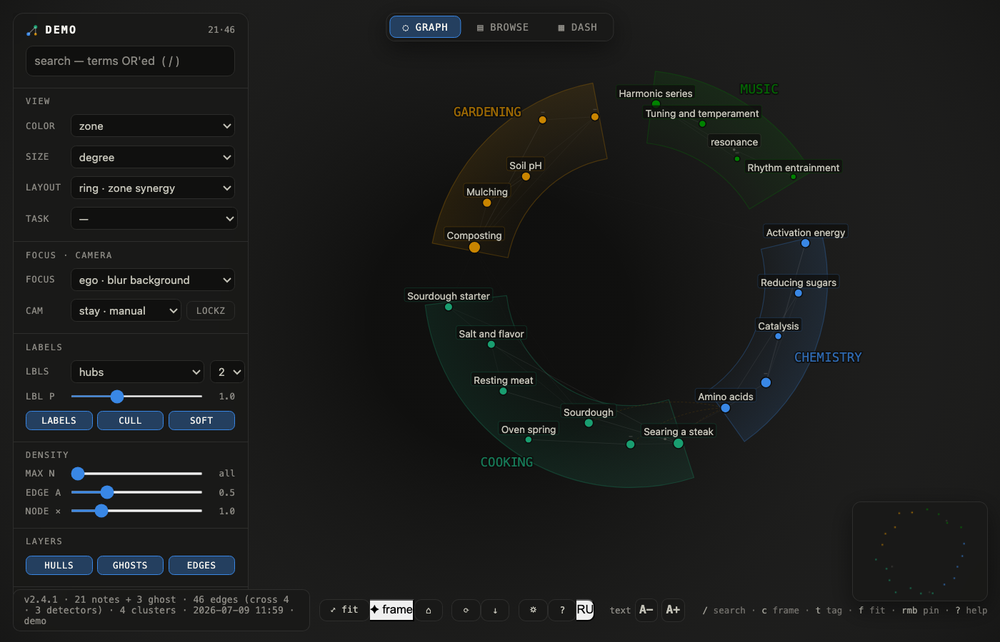
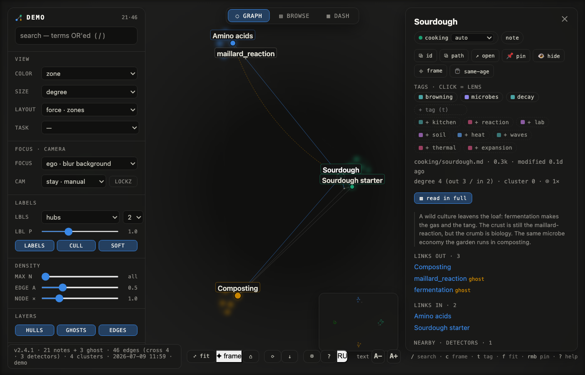

# memory-atlas

[](https://github.com/zzallirog/memory-atlas/actions/workflows/ci.yml)

Turn a folder of markdown notes into **one self-contained interactive graph** — a single HTML file. No server, no build step, no cloud: Python 3 stdlib in, `file://` page out.

The point isn't "a graph of my wikilinks". It's **overlap**: the generator runs a set of detectors that surface links you never wrote by hand — a missing note two clusters both reference, overlapping tags, notes edited in the same sitting — and draws them on top of your explicit `[[wikilinks]]`.



*Four folders — chemistry, cooking, gardening, music — laid out on a zone-synergy ring. The dashed lines cutting across the center are bridges the detectors drew: notes in different folders that share a missing reference, a tag, or a co-edit. Nobody wrote those links by hand.*

## Quick start

```bash
git clone https://github.com/zzallirog/memory-atlas && cd memory-atlas
./memory-atlas --demo            # tiny synthetic vault, opens in your browser
./memory-atlas --src ~/my-vault  # your own notes
./memory-atlas --src ~/vault --src ~/wiki --src ~/snippets   # several roots, one graph
```

`--src` is repeatable: the first root keeps its index-based zones, every extra root becomes
one zone of its own, and `[[links]]` resolve same-root first, then across roots — a link that
used to dangle as a ghost snaps to the real note in the other root. `--dump-data -` emits the
graph JSON instead of rendering (the source end for external pipeline builders).

Or the zero-clone route — one file, nothing else:

```bash
python3 dist/memory-atlas.pyz --demo
python3 dist/memory-atlas.pyz --src ~/my-vault
```

On **Windows** the same two routes work — the generator is stdlib Python and the output opens via the default browser:

```powershell
py memory-atlas --demo
py dist\memory-atlas.pyz --src C:\Users\you\vault
```

Requirements: **Python 3.8+ and a browser.** That's the whole list. macOS, Linux and Windows are exercised in CI (self-test + demo build + `.pyz` build on all three). Obsidian vaults work out of the box (`.obsidian/`, `.trash/` skipped, frontmatter `tags:` read). Each top-level folder becomes a colored zone.

Full walkthrough: [docs/QUICKSTART.md](docs/QUICKSTART.md). More lives of the same tool — a worldbuilding campaign, a homelab runbook, reading notes, language study, trip planning — in the **[gallery](docs/GALLERY.md)**, each with a runnable example vault. How layouts, the **grouping axis** and the reading views compose: [docs/VIEWS.md](docs/VIEWS.md).

## What you get



*Select a node and the rest blurs back. Here the selected node is `fermentation` — a **ghost** (no file), yet referenced from `composting` in the garden folder and `sourdough` in the kitchen folder. Two zones quietly leaning on the same un-written note is exactly the overlap the tool exists to surface.*

- **Overlap detectors** (build-time, all local): shared missing references (`shared_ref`), tag overlap (Jaccard), temporal co-editing, git co-commits, and — optionally, if you run [Ollama](https://ollama.com) — semantic similarity by embeddings. Without Ollama the generator prints one warning and carries on; every other bridge still works.
- **9 layouts** (force / semantic / pack / ring / petals / radial / grid / zones / timeline), morph animated, `[` `]` to cycle; task presets that set layout+color+layers in one pick.
- **Lenses instead of hairballs**: click a tag — only tagged notes stay sharp, the rest dissolves into blur. Same engine drives the ⌚ *temporal lens*: pick a note, see everything edited in the same time window (2→7→30 days). Detector edges are hidden by default and served through lenses — lines are noise until you ask.
- **Read in place**: hover previews, description snippets under neighbors when a note is focused, a full **browse** tab (three-pane reader over the same data), and a **dash** tab (zones, freshness, ghost debts, data health).
- **Continuous zoom LOD**: dots → labels → cards with description previews, one smooth ramp.
- **Local usage telemetry** (localStorage only): a `usage` color mode shows which notes *you* actually open.
- **UI in English or Russian** — RU/EN toggle in the bottom bar, choice persists.
- Pins, saved views, deep links (`?state=`), user-drawn edges, zone overrides, profile export/import — all persisted in your browser, exportable as one JSON.

## Privacy

Everything runs on your machine and the output is a static local page. The generated HTML **embeds note titles, descriptions and body text** — treat the built file like the vault itself: regenerate for others, don't reshare yours. The demo vault is synthetic.

## Zones — your names, not ours

A zone is a coloured region of the map. By default every top-level folder in your vault
becomes one, laid out on a circle — nothing to configure.

If you want particular projects to be zones with a fixed place on the map (so the layout
stays put as the vault grows), declare them yourself. Drop `.atlas-zones.json` in the vault
root, or point `$ATLAS_ZONES` at one:

```json
{
  "folders": ["research", "journal", "clients"],
  "anchors": { "research": [-0.1, -0.75], "journal": [0.65, 0.65] }
}
```

- `folders` — top-level folders that become zones of their own.
- `anchors` — where each sits, in `[-1..1]` coordinates (`[0,0]` is the centre). Optional;
  anything you leave out is placed automatically.

Three ways to end up with a useful set of zones, in increasing order of effort:

1. **Do nothing.** Folders are zones. For most vaults this is the whole answer.
2. **Write the file by hand** once you know which projects you want pinned where.
3. **Let a model draft it.** Point any LLM you already use at your folder listing and ask
   for a `.atlas-zones.json` grouping them into 5–8 zones. It is a small, checkable file —
   read it before you keep it, and move an anchor if a zone sits somewhere you dislike.

If a vault has no structure worth pinning yet, that is a normal state: build the atlas
first, look at what clusters, and write the zones afterwards.

## Honest scope

- Built first for the author's own memory corpus; foreign-vault support (Obsidian layouts, arbitrary zones) is tested on synthetic and real vaults but younger than the core.
- Up to 8 zones get distinct colors; more fall into a shared grey.
- The `semantic` layout uses PCA over embeddings — honest cosine geometry, weaker separation than UMAP would give.
- Rendering is 2D canvas, comfortable at a few hundred notes; thousands untested.

## Layout of this repo

```
memory-atlas                  # generator (Python 3 stdlib, single file)
memory-atlas.template.html    # D3-canvas render template (must sit next to the generator)
vendor/d3.v7.min.js           # D3 v7 (ISC license), inlined into the output
demo/                         # synthetic two-zone demo vault
installer/build-pyz.sh        # packs everything into dist/memory-atlas.pyz
dist/memory-atlas.pyz         # prebuilt single-file bundle
docs/QUICKSTART.md            # the friendly walkthrough
```

`./memory-atlas --self-test` runs the built-in test suite. Press `?` inside the atlas for every key and edge type.

## Development

- `dist/` is a build artifact (`python3 installer/build_pyz.py`), gitignored in dev; the published repo ships a prebuilt copy for the zero-clone route.
- Deployed locally as `~/bin` symlinks (generator + template travel as a PAIR — the generator warns on version skew).
- Durable off-machine backup channel: `git push origin main` (bare repo); Gitea intentionally skipped per backup topology.
- CI (`.github/workflows/ci.yml`): ubuntu/macos/windows × py3.8/3.12 — self-test + demo build + `.pyz` build.

## Changelog

- **2.15.0** (2026-07-18) — hiding a zone now re-places the graph. `layoutTargets()` computed every layout over `nodes.filter(n => !n.ghost)` — the whole corpus, filter or no filter — so the survivors of a hidden zone kept coordinates sized for the full set. On a 2370-note vault whose 2125-term glossary is meant to be filtered away, the taxonomy view read as an empty canvas with a stray arc along the edge: the remaining 245 notes were still strung around a circle drawn for 2405. `fitView()` was innocent — it frames `visible()`; the coordinates were the stale part. Layouts now compute over the visible set (falling back to every non-ghost so an all-hidden view cannot divide by zero), and `toggleZone` recomputes a computed layout (`force` is left alone — it re-settles on its own). Verified on the live 2405-node corpus, before/after, with the visibility state stamped into the frame.
- **2.14.0** (2026-07-18) — the hover-pin card and the right bar stop being two hand-written copies of one idea. Both now render the same blocks through shared builders (chips · actions · tags · meta · links · detector neighbours) and share one delegated click vocabulary, so a link, a tag-lens or `⧉ path` behaves the same on either surface; panel section CSS is widened with `:is(#panel, .hpcard)` and a self-test fails if a second copy of the section markup appears. What the copies had cost: the pin had no section headers, rendered detector neighbours as an unlabelled count histogram, and its tag chips did not open the lens. Fixed alongside, each reproduced live first: `✕` never closed a pin (raising the card re-appended it to the DOM, which cancels the pending click); overlapping pins swallowed each other's controls (raise is a z-index counter now, `Esc` closes the topmost card, hit areas 13px → 22px); a freshly created pin was never persisted; pins floated over the browse reader; segmented bar buttons dropped their left border so the grey neighbour painted over the hovered accent ring; `RMB`-pin panned the camera even for a node already centred, and "centre" ignored the panels covering the canvas. New: hovering a card draws a hairline to the node it pins. Left bar: `⇤ автоскрытие / ⇥ закреплён` keeps the HUD up while a note is open (new `hudAuto` config key), the fold control moved into a sticky foot — unfolded, it used to scroll out of reach and became a one-way door — sections now reveal with a staggered fade, and the lens pill is actually centred (its entry animation was overwriting the `translateX(-50%)` that centred it).
- **2.13.1** (2026-07-18) — release: first tag to ship the prebuilt `dist/memory-atlas.pyz` as a downloadable asset (the zero-clone route the README promises); rolls up the 07-18 editor polish (reader-mode, hover-pin cards, "категория · авто" unified axis, `--fast-regen`, uk locale fix) and the `atlas-serve` exec bit. No generator behaviour change vs 2.13.0.
- **2.13.0** (2026-07-18) — editor pass: hover-pin overhaul (aero-glass background so text never flickers, free placement + reload persistence via localStorage, distinct-link dedupe, open-in-right-bar button, in-card tag editing + per-detector edge counts, fold/copy controls); document import — `atlas-serve` `/api/import` converts arbitrary files to markdown via markitdown (or keeps them as-is), with an import panel in the new-note UI (see `docs/IMPORT-FORMATS.md` for the tested format matrix and what degrades).
- **2.12.0** (2026-07-11) — trilingual UI: Ukrainian (i18nUK) added; the bar language button cycles RU → EN → UK, RU stays canonical markup.
- **2.11.0** (2026-07-10) — release aggregate of the 07-10 wave: frametime pass v2.10.1-v2.10.5 (perf) + scale pass v2.10.6 (features) + perf/ bench harness; published to GitHub with rebuilt dist.
- **2.10.6** (2026-07-10) — scale pass: the group axis is cardinality-capped per layout (410 louvain topics minted 410 spine headers / facet panels / hulls — the text-wall screens; top groups keep sections, the tail merges into one … group routed to the arc/disc, hulls skip it); density-LOD (scale-free reading: few notes in frame = card previews with body, whatever the layout inflated the world to — «3-6 on screen» zoom now exists on every view); node screen-radius floor (sub-pixel rim nodes were invisible and unclickable); dendro branch skeleton (the crown no longer rings an empty disc); group-title fonts capped in screen terms (giant CAPS stopped growing with zoom); ✦ orient is a smooth eased tween (the 6 random jumps read as no animation at all).
- **2.8.0** (2026-07-09) — multi-root vaults: repeatable `--src [NAME=]DIR` (first root = primary index zones, extras one zone each, cross-root `[[link]]` resolve kills ghosts, readable parent-dir ids on stem collisions, per-root editor paths via `DATA.roots`); `--dump-data FILE|-` (DATA JSON out, pipeline source end); `temporal_proximity` now caps node DEGREE at top-k=2 (the per-source cap let hub notes collect a rose dash from everyone — ~1250 → ~250 edges).
- **2.4.1** (2026-07-09) — refine pass: `--data` contract validator (broken external graphs fail at build time, not as a dead page); session detector fixed for vaults living in a subdir of a git repo (`git log --relative`); `--demo` also mutes the session detector (packaging commits ≠ sessions); preset toasts translate in EN mode; generator↔template version handshake (`atlas-tpl` meta, warns on stale symlink pair); `maxN` "all" persists as a sentinel (a grown corpus no longer comes back silently top-N-filtered); client semantic search honors `ATLAS_OLLAMA`; `.pyz` compressed (590K → 195K); dead edge-hover code removed.
- **2.4.0** (2026-07-09) — public-release pass: EN comments/CLI, generic path autodetect, Windows toolchain + CI matrix, locale-auto UI language, pin cards with preview + view capture.
- **2.3.0** (2026-07-09) — continuous zoom LOD, temporal lens, ego-blur at half resolution (fps), panel link previews, usage telemetry, editor URL-schemes.
- **2.2.0** (2026-07-08→09) — tag-lens ("blur + emptiness"), hover-preview cards, HUD bar-blocks, generator portability for Obsidian vaults, adaptive readability, EN i18n layer + RU/EN toggle, installer zipapp + synthetic demo vault.
- **2.1.0** (2026-07-08) — label declutter + density axis, ego-blur cache (60→10fps drag lag fixed), context-aware fit.
- **2.0.0** (2026-07-08) — first versioned release: 9 layouts, task presets, server-less regen admin.

## License

MIT. Bundles [D3 v7](https://d3js.org) (ISC, © Mike Bostock).
