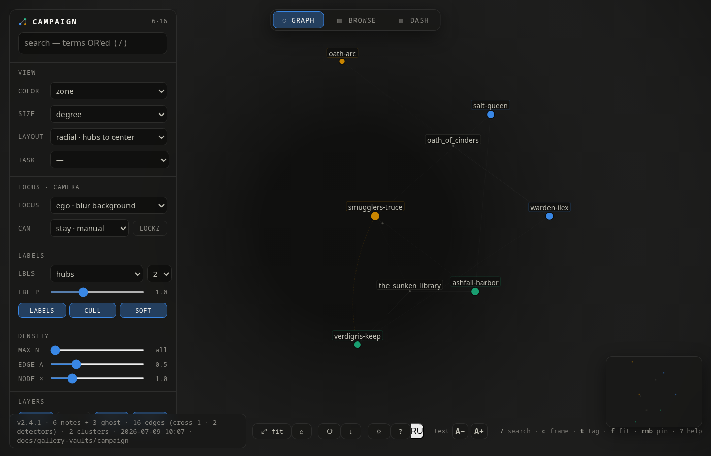
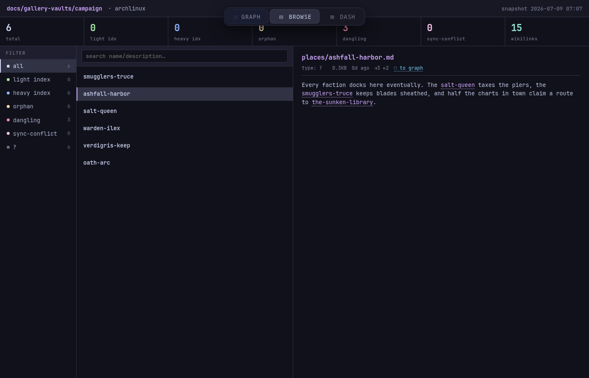
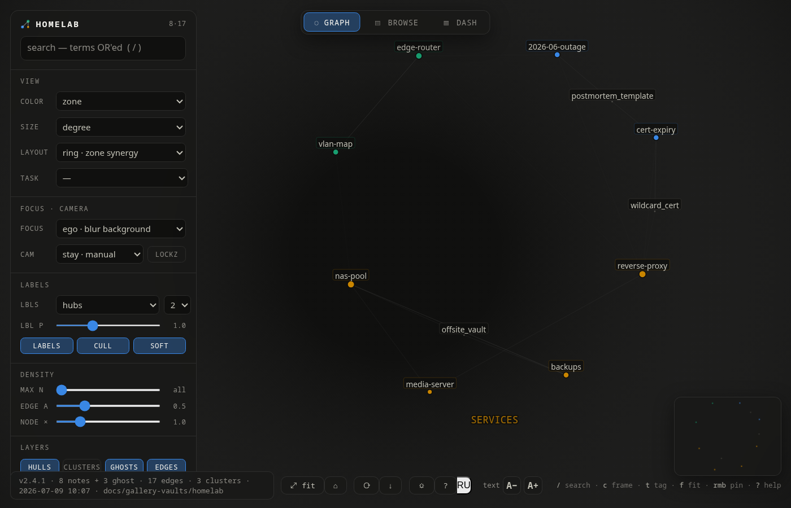
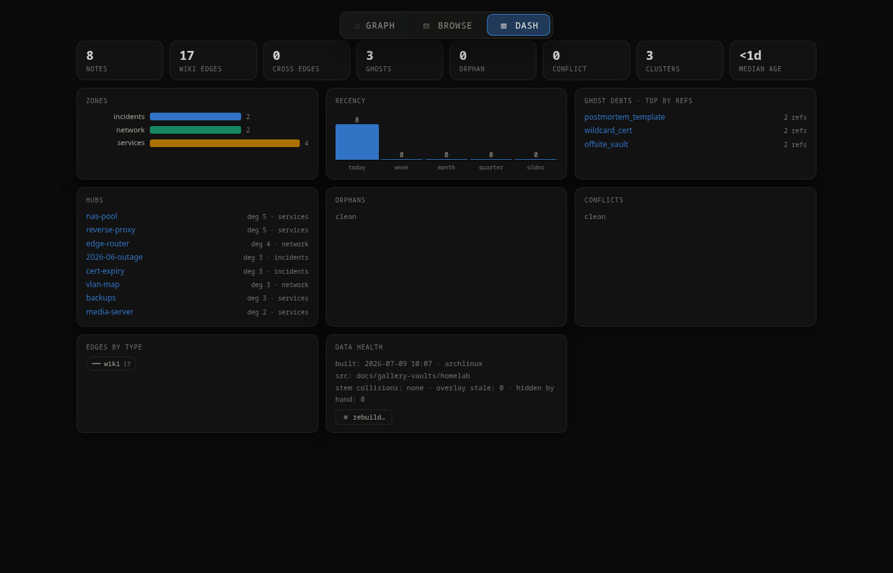
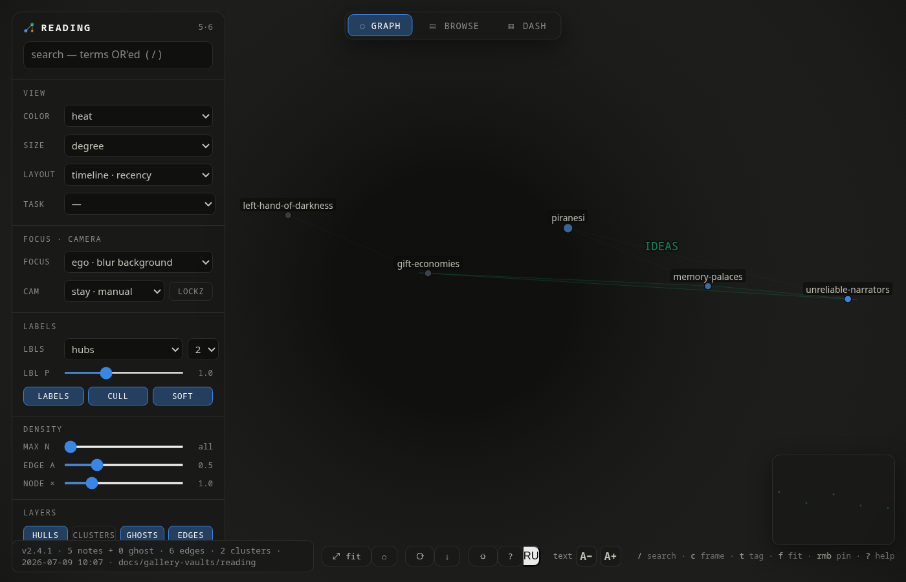
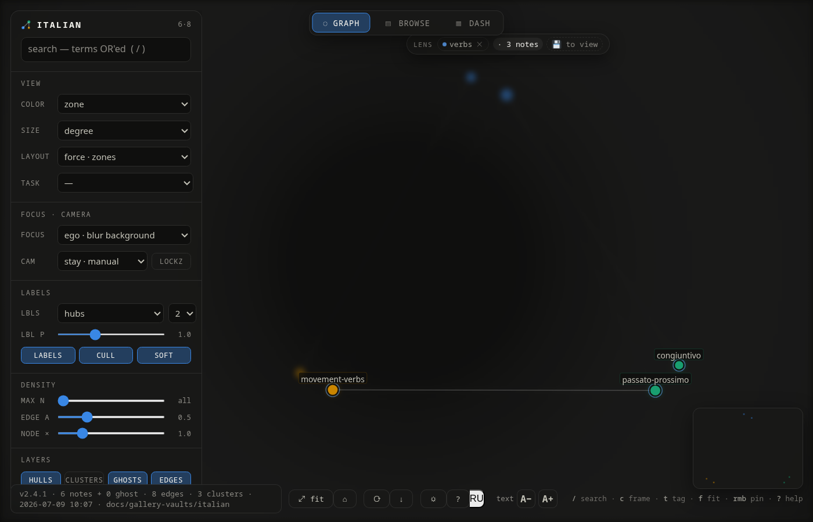
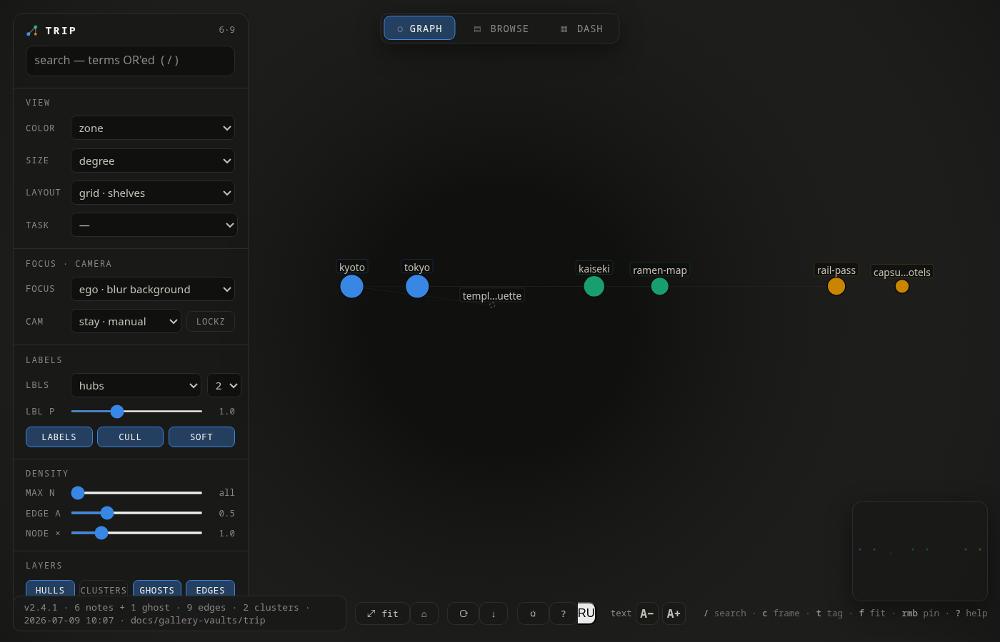

# Gallery — the same tool, different lives

[← back to README](../README.md)

Every case below is a tiny **runnable vault** checked into `docs/gallery-vaults/` —
rebuild any screenshot yourself:

```bash
./memory-atlas --src docs/gallery-vaults/<case> --lang en \
  --no-semantic-cross --no-temporal-cross --no-session-cross
```

(The three `--no-*` flags keep the builds deterministic and offline — the bridges you
see are wikilinks, shared ghosts and tag overlap only. Then open the printed file with
the query string from the case.)

---

## Worldbuilding campaign — who leans on the unwritten



A TTRPG vault: `places/`, `people/`, `plot/`. The dashed nodes are **ghosts** — notes
the campaign already references but nobody has written: `the_sunken_library` is cited
from two different zones (that dashed bridge through the middle is the `shared_ref`
detector), `oath_of_cinders` binds a person to a plot arc. The graph is literally the
GM's debt list.

`?layout=radial&color=zone`

## The same campaign, read in place



The **browse** tab is a terminal-style reader over the same data: stats strip, filters,
full note text with live wikilinks (dead ones flagged red). Deep-linkable:

`?tab=browse&node=ashfall_harbor`

## Homelab runbook — which subsystems intertwine



`services/`, `network/`, `incidents/` on a **synergy ring**: zones that share edges sit
next to each other, and the incident notes visibly hang between the service and the
network they took down. Ghosts here are process debts — `postmortem_template` is
referenced by two incidents and still doesn't exist.

`?layout=ring&color=zone`

## The same homelab, as a console



The **dash** tab: corpus KPIs, freshness histogram, ghost debts ranked by references,
hubs, data health. Every row clicks through to the graph or the reader.

`?tab=dash`

## Reading notes — when ideas arrived



Book notes and essay seeds on a **timeline**: freshest on the right, color = recency,
one lane per zone. Six months of reading reads left-to-right; the wikilinks show which
novel fed which idea.

`?layout=timeline&color=heat`

## Language learning — one tag as a lens



An Italian-learning vault (`grammar/`, `vocab/`, `dialogues/`) with frontmatter tags.
Clicking the `verbs` tag turns the view into a **lens**: only tagged notes stay sharp,
everything else dissolves into blur. The lens travels in the link itself (`?state=`
carries tags + layout + color), so a study slice is shareable as one URL.

`?state=eyJ2IjogMSwgImxheW91dCI6ICJmb3JjZSIsICJjb2xvciI6ICJ6b25lIiwgInRhZ3MiOiBbInZlcmJzIl19`

## Trip planning — shelves, not clouds



A Japan-trip vault on **grid shelves**: one shelf per zone (`cities`, `logistics`,
`food`), sorted by connectivity — it scans like a table but keeps the links. The ghost
`temple_etiquette` is referenced from both a city plan and a dinner booking: a note the
trip apparently needs.

`?layout=grid&color=zone`

---

Nine layouts, task presets, pins, saved views and the rest of the controls are described
in [QUICKSTART](QUICKSTART.md) and in the in-app help (`?`).
