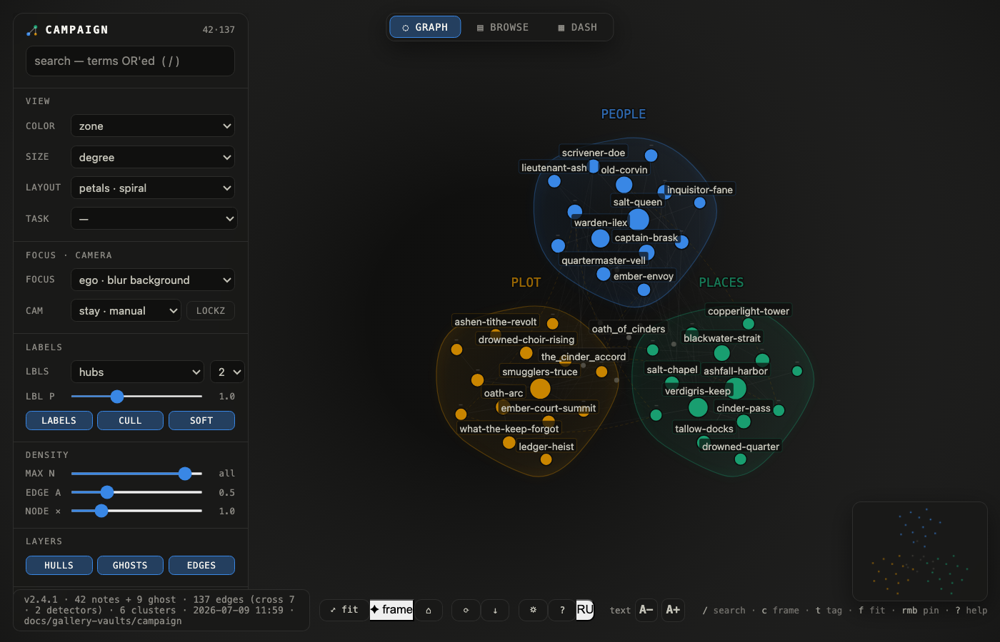

# Gallery — the same tool, different lives

[← back to README](../README.md)

Every case below is a tiny **runnable vault** checked into `docs/gallery-vaults/` —
rebuild any screenshot yourself:

```bash
./memory-atlas --src docs/gallery-vaults/<case> --lang en \
  --no-semantic-cross --no-temporal-cross --no-session-cross
```

(The three `--no-*` flags keep the builds deterministic and offline — the bridges you
see are wikilinks, shared ghosts and tag overlap only. Then open the printed file with
the query string from the case.)

---

## Worldbuilding campaign — the vault as a flower



A TTRPG vault: `people/`, `places/`, `plot/`. The **petals** layout gives each zone its
own phyllotaxis spiral — hubs at the core, periphery at the rim — and the zone hulls
render as soft gradient petals around them. The unwritten notes (dashed ghosts) settle
*between* the petals they're cited from: `oath_of_cinders` hangs between the person who
swore it and the arc it drives. The whole campaign reads as one flower.

`?layout=petals&color=zone`

## The same campaign — who leans on the unwritten


The **radial** layout pulls hubs toward the center. Dashed nodes are **ghosts** — notes
the campaign already references but nobody has written: `the_sunken_library` is cited
from all three zones (that's the `shared_ref` detector talking), `maps_of_the_undertide`
binds people to plot. The graph is literally the GM's debt list.

`?layout=radial&color=zone`

## The same campaign, read in place


The **browse** tab is a terminal-style reader over the same data: stats strip, filters,
full note text with live wikilinks (dead ones flagged red). Deep-linkable:

`?tab=browse&node=ashfall_harbor`

## Homelab runbook — which subsystems intertwine


`services/`, `network/`, `incidents/` on a **synergy ring**: zones that share edges sit
next to each other, each zone drawn as a tinted arc band, and the incident notes visibly
hang between the service and the network they took down. Ghosts here are process debts —
`postmortem_template` is referenced by three incidents and still doesn't exist.

`?layout=ring&color=zone`

## The same homelab, as a console


The **dash** tab: corpus KPIs, freshness histogram, ghost debts ranked by references,
hubs, data health. Every row clicks through to the graph or the reader.

`?tab=dash`

## Reading notes — when ideas arrived


Six months of books and essay seeds on a **timeline**: freshest on the right, color =
recency, one petal-lane per zone (`fiction`, `nonfiction`, `ideas`). The wikilinks show
which book fed which idea — `piranesi` and a mnemonics manual both drain into
`memory_palaces`.

`?layout=timeline&color=heat`

## Language learning — one tag as a lens


An Italian-learning vault (`grammar/`, `vocab/`, `dialogues/`) with frontmatter tags.
Clicking the `verbs` tag turns the view into a **lens**: the eleven tagged notes stay
sharp across all three zones, everything else dissolves into blurred petals. The lens
travels in the link itself (`?state=` carries tags + layout + color), so a study slice
is shareable as one URL.

`?state=eyJ2IjogMSwgImxheW91dCI6ICJmb3JjZSIsICJjb2xvciI6ICJ6b25lIiwgInRhZ3MiOiBbInZlcmJzIl19`

## Trip planning — shelves, not clouds


A Japan-trip vault on **grid shelves**: one shelf per zone (`cities`, `logistics`,
`food`), sorted by connectivity — it scans like a table but keeps the links. The ghost
`temple_etiquette` is referenced from a city plan and two dinner notes: a note the trip
apparently needs.

`?layout=grid&color=zone`

---

Nine layouts, task presets, pins, saved views and the rest of the controls are described
in [QUICKSTART](QUICKSTART.md) and in the in-app help (`?`).
