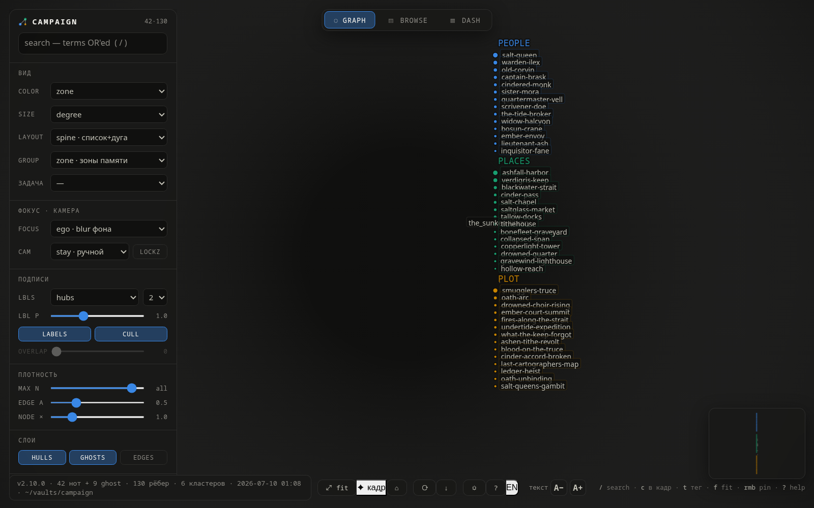
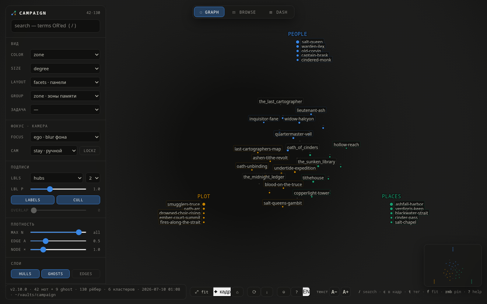
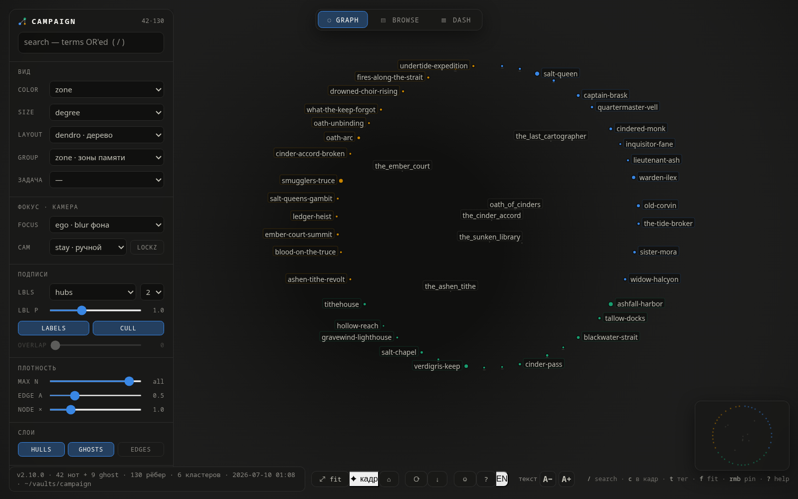
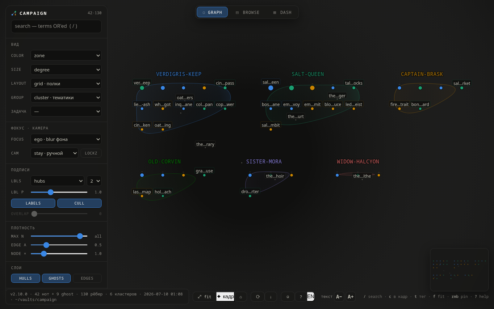

# Views & grouping — how the left bar composes

The HUD is one sentence: **LAYOUT is the shape, GROUP is the cut, COLOR is the ink.**
Every control below composes with every other — pick a shape, slice it by an axis,
ink it by a third one. Nothing here needs a rebuild; it is all live.

## The grouping axis (v2.10)

`GROUP` slices every grouping layout — `pack · ring · petals · radial · grid ·
zones · spine · facets · dendro` — and the force layout's link distances follow it too
(same-group notes cluster, cross-group edges stretch). Hull outlines and hull titles
follow the chosen axis as well.

| group | what it slices by |
|---|---|
| `zone` | memory zones (index membership / top dir) — the default |
| `root` | vault root (`--src name=dir`) — origin in a multi-root vault |
| `cluster` | louvain topology topics |
| `type` | note type from frontmatter |
| `age` | recency buckets (week / month / quarter / year / older) |

The chosen axis persists (config), travels in saved views and in `?state=` /
`?group=` deep links.

## Reading views (v2.10)

Three list-shaped layouts where **text is the first-class element** — names are
always readable, not decoration over dots:

### spine · list + arc

The strongest notes of every group as a central readable list with section
headers; the rest of the corpus on a surrounding arc, edges connecting arc to
list. On a small vault the whole corpus fits the list — a literal table of
contents. Task preset: **reading · list**.

### facets · panels

Group values sit on the perimeter as labeled mini-panels (top notes each), the
long tail fills the center disc inside its group's wedge. The perimeter reads
like a facet browser: what values exist, what their anchors are.

### dendro · tree

A radial dendrogram (group ⊃ cluster ⊃ note): the whole vault as one labeled
tree crown, every leaf name anchored outward from the rim.

### grid × group

The classic shelves, sliced by any axis — e.g. `group=cluster` turns the shelf
blocks into topic shelves:

## Reading at a distance (v2.10)

- Node cards arrive earlier on the zoom ramp (`K≥1.5`) and carry **body text**:
  the curated `desc` first, then the note's own prose. Lines wrap on words, each
  line a touch quieter, the last line dissolving left→right into transparency —
  a card reads as an excerpt, not a chopped string.
- The ambient label budget is ~2.5× higher; collision-cull still governs, so it
  degrades to what physically fits.
- In spine/facets the list rows are never budget-culled — they are the reading
  surface.

## The rest of the left bar

| card | what it does |
|---|---|
| **вид / view** | color · size · layout · **group** · task presets (one-pick layout+color+layers) |
| **фокус · камера** | what selection does (dim / ego-blur / tiles) · camera policy (stay = manual zoom) |
| **подписи / labels** | who gets a name (hubs / hops / near / all) · density multiplier · collision cull · overlap |
| **плотность / density** | top-N by degree · edge alpha · node size |
| **слои / layers** | group hulls · ghost nodes · all-edges toggle (key 9) |
| **моушн / motion** | edge particles (direction = who references whom) · cursor magnet · gestures |
| **зоны / zones** | chips: hide/show a zone (keys 1–8) |
| **рёбра по типу** | edge layers per detector kind, incl. builder-declared kinds (provenance: `moved_from`, `became`) |
| **теги · линза** | tag lens: tagged notes stay, the rest dissolves; ∪/∩ multi-tag |
| **легенда / legend** | click a row = isolate the group; metric rows (e.g. `forgotten`) = threshold lens |
| **пины / pins** | rmb pin stack (context delivery), pin remembers its view |
| **виды / views** | saved camera+filters+layout+**group**+motion under a name |
